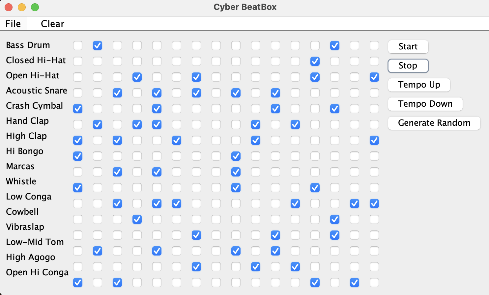

# Beat-Box Music

BeatBox-Music is a Java application that allows you to create and play MIDI-based music patterns. It provides a graphical interface where you can compose rhythms using a grid of checkboxes representing different musical notes.

## Prerequisites
To run this project, you need to have Java installed on your system.

## Getting Started
To get started with BeatBox-Music, follow these steps:

1. Clone this repository to your local machine or download it as a ZIP file.
2. Ensure that you have Java installed on your system.
3. Locate the CyberBeatBoxCSO.jar file.
4. Run the application by double-clicking on the JAR file, or you can run it from the command line using the following command:

```bash
java -jar CyberBeatBox.jar
```

## Screenshot



## Usage
 Once you have successfully launched the BeatBox-Music application, you can use it to play MIDI music. Explore the various features provided by the application to customize your music experience.

- Instrument Selection: Choose from a variety of 16 different instruments.
- Pattern Creation: Create custom musical patterns by turning individual notes on or off in the grid.
- Tempo Control: Adjust the tempo of the music using the "Tempo Up" and "Tempo Down" buttons.
- Play and Stop: Start and stop the playback of your music patterns using the "Start" and "Stop" buttons.
- Random Pattern Generation: Generate random music patterns for experimentation.
- Save and Load Patterns: Save your created music patterns to a file and load them for playback or editing.

## Contributing
Contributions to BeatBox-Music are welcome! If you want to contribute to this project, please follow these steps:

1. Fork this repository.
2. Create a new branch with a descriptive name for your feature or bug fix.
3. Make your changes and test them thoroughly.
4. Commit your changes and push them to your forked repository.
5. Create a pull request in this repository, describing your changes and their purpose.

## License
This project is licensed under the [MIT](https://choosealicense.com/licenses/mit/) License.
